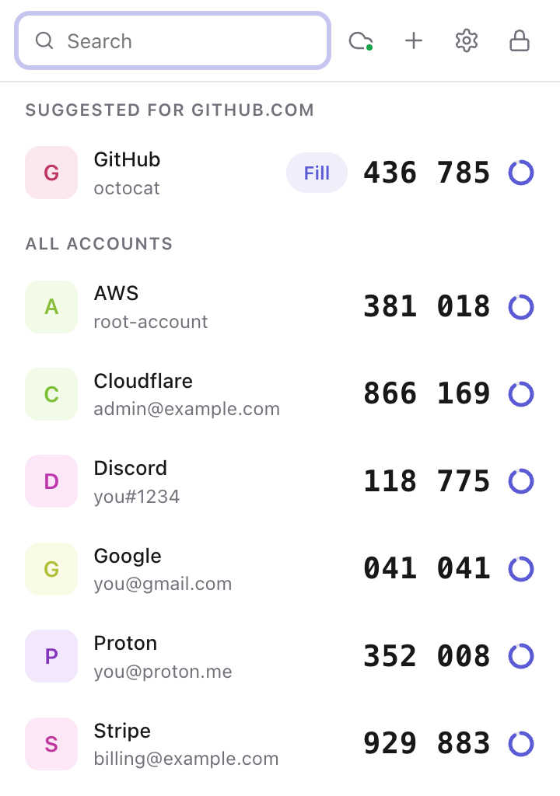
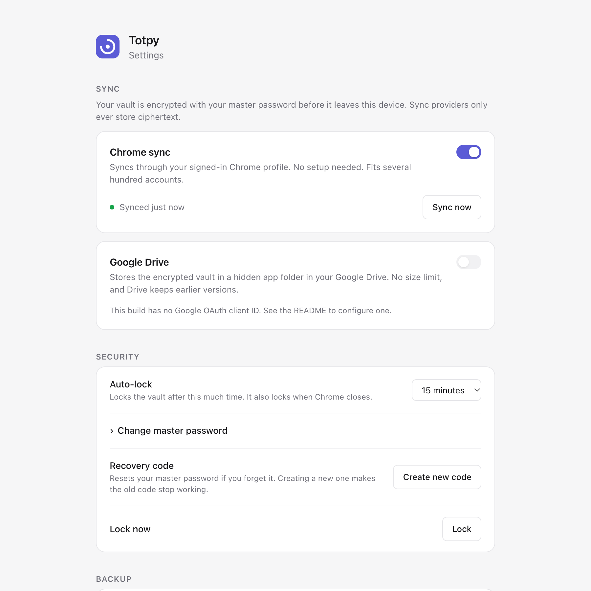

<p align="center">
  
</p>

<h1 align="center">Totpy</h1>

<p align="center">
  <strong>Open-source 2FA codes in your browser.</strong><br>
  End-to-end encrypted sync, one-click fill, and no account to create.
</p>

<p align="center">
  <a href="https://github.com/amit-y11/totpy/actions/workflows/ci.yml"></a>
  <a href="LICENSE"></a>
  
  
  <a href="CONTRIBUTING.md"></a>
</p>

<p align="center">
  <a href="https://totpy.org"><strong>totpy.org</strong></a> ·
  <a href="#install">Install</a> ·
  <a href="#features">Features</a> ·
  <a href="#sync-across-devices">Sync</a> ·
  <a href="#security">Security</a> ·
  <a href="#faq">FAQ</a> ·
  <a href="CONTRIBUTING.md">Contributing</a>
</p>

<p align="center">
  <picture>
    <source media="(prefers-color-scheme: dark)" srcset="docs/images/popup-dark.png">
    
  </picture>
</p>

## Why Totpy?

Most authenticators live on your phone. You sign in on your computer. Totpy puts your 2FA codes
in the browser, where you actually need them, without giving up on security:

- **Encrypted, always.** Your codes are locked with a master password. There is no unencrypted
  mode.
- **Sync without trusting anyone.** Chrome sync and Google Drive only ever see ciphertext.
- **No servers, no accounts, no tracking.** Totpy has no backend. Nothing to sign up for,
  nothing to breach.
- **No limits, no paywall.** Every feature is free, forever. MIT licensed.
- **Readable builds.** The shipped code is bundled but not minified, so anyone can check what
  runs.

## Features

**Codes**

- 6, 7 or 8-digit time-based codes (TOTP, [RFC 6238](https://www.rfc-editor.org/rfc/rfc6238)) with
  SHA-1, SHA-256 or SHA-512
- Click to copy, search, and a countdown for every code
- **Fill** codes into the page, or right-click any field and choose **Insert 2FA code**
- Suggests the right account for the site you are on
- Warns you when your computer's clock is off far enough for codes to be rejected

**Adding accounts**

- Scan a QR code shown on the current page, or upload a QR image
- Paste an `otpauth://` link, or type the setup key
- Import everything from **Google Authenticator** (its "Transfer accounts" QR code)
- Import a list of `otpauth://` links from another app

**Sync and backup**

- End-to-end encrypted sync through **Chrome sync** (no setup) and **Google Drive** (optional)
- Changes merge across devices, including deletions and password changes
- **Automatic copies**: one encrypted snapshot a day for the last 7 days
- Encrypted backup files, and plain `otpauth://` export to move to another app

**Security**

- AES-256-GCM encryption, PBKDF2 key derivation with 600,000 iterations
- A **recovery code** to reset your password if you forget it
- Auto-lock, and locks when Chrome closes
- No access to websites until you click Fill or Insert (`activeTab`)

<p align="center">
  <picture>
    <source media="(prefers-color-scheme: dark)" srcset="docs/images/settings-dark.png">
    
  </picture>
</p>

## Install

**Chrome Web Store:** coming soon.

**From a release**

1. Download `totpy-<version>.zip` from the [latest release](https://github.com/amit-y11/totpy/releases)
   and unzip it.
2. Open `chrome://extensions`, turn on **Developer mode** and click **Load unpacked**.
3. Select the unzipped folder, then pin Totpy to the toolbar.

**From source**

```bash
git clone https://github.com/amit-y11/totpy.git
```

```bash
cd totpy && npm install && npm run build
```

Then load the `dist/` folder with **Load unpacked** as above. Building needs Node.js 22.18 or
newer.

## Getting started

1. **Create a master password.** Totpy then shows your **recovery code** once. Save it somewhere
   outside the browser; it is the only way back in if you forget the password.
2. **Add an account.** On a site's 2FA setup page, open Totpy, click **+** and choose **Scan QR on
   page**. You can also upload a QR image, paste a link or type the setup key.
3. **Sign in.** When a site asks for a code, open Totpy and click **Fill**, or right-click the
   code field and choose **Insert 2FA code**. Clicking a code copies it.

> [!TIP]
> Keep the backup codes each website gives you when you turn on 2FA. They get you into that
> account even without Totpy.

## Sync across devices

| Provider     | Setup               | Capacity              | Notes                    |
| ------------ | ------------------- | --------------------- | ------------------------ |
| Chrome sync  | None                | Several hundred codes | Uses your Chrome profile |
| Google Drive | Sign in with Google | Unlimited             | Drive keeps old versions |

Turn providers on in **Settings → Sync**. Both store the same encrypted file, and every device
merges changes automatically: new accounts, edits and deletions from all devices are combined,
and the newest edit wins.

Google Drive sign-in is tied to the Chrome Web Store version. If you load Totpy unpacked from a
release zip or from source, set up your own [OAuth client ID](docs/google-drive.md) to use Drive.

- **New device with Chrome sync:** install Totpy in a Chrome profile signed in to the same Google
  account. It finds your vault and asks for your master password.
- **New device with Google Drive:** open **Settings** and choose **Restore from Google Drive**.
- **Changed your password?** Other devices switch to the new one the next time they sync.

## Security

Totpy encrypts your vault with a random 256-bit key. That key is locked twice, by your master
password and by your recovery code, so you can change the password without re-encrypting
anything and every synced device keeps working. Synced copies are authenticated, so a tampered
copy can't lock you out or weaken the encryption.

Read the full design in **[docs/security.md](docs/security.md)**. To report a vulnerability,
see **[SECURITY.md](SECURITY.md)**. Please don't open a public issue.

## Privacy

Totpy has no servers, analytics or tracking. Your codes are generated on your device. The only
network requests are the sync providers you turn on, and an empty request to Google every few
hours to check your clock. See **[PRIVACY.md](PRIVACY.md)**.

## FAQ

<details>
<summary><strong>What if I forget my master password?</strong></summary>

Use your recovery code: click **Forgot password?** on the unlock screen, enter the code and
choose a new password. If you lose both, your codes cannot be decrypted by anyone, including us.
Use the backup codes each website gave you to get back into those accounts.

</details>

<details>
<summary><strong>Can I use it on my phone?</strong></summary>

Not yet. Chrome on phones doesn't run extensions. When you set up 2FA, you can scan the same QR
code with a phone authenticator too; both will show the same codes.

</details>

<details>
<summary><strong>Does it work in Edge, Brave or Firefox?</strong></summary>

Totpy is built and tested for Google Chrome. Other Chromium browsers should work but are not
tested yet, and Google Drive sync needs Google Chrome. Firefox support is on the
[roadmap](#roadmap).

</details>

<details>
<summary><strong>How do I move from Google Authenticator?</strong></summary>

In Google Authenticator, choose **Transfer accounts → Export accounts**. Take a photo of the QR
code with another device, then in Totpy click **+ → Upload QR**. All accounts are imported at
once.

</details>

<details>
<summary><strong>Does it work offline?</strong></summary>

Yes. Codes are generated on your device. Only sync and the clock check need a connection.

</details>

<details>
<summary><strong>Are counter-based (HOTP) or Steam codes supported?</strong></summary>

Not yet. Totpy supports time-based codes (TOTP), which almost every service uses.

</details>

## Roadmap

- [ ] Publish to the Chrome Web Store
- [ ] Scan QR codes with the computer's camera
- [ ] Groups and favorites
- [ ] Translations
- [ ] Firefox support
- [ ] More sync providers (WebDAV, Dropbox)
- [ ] HOTP and Steam Guard codes

Have an idea? [Open a feature request](https://github.com/amit-y11/totpy/issues/new/choose).

## Contributing

Contributions are welcome, from bug reports to new sync providers. Start with
**[CONTRIBUTING.md](CONTRIBUTING.md)**, and please follow the
**[Code of Conduct](CODE_OF_CONDUCT.md)**.

```bash
npm install && npm run dev
```

## Acknowledgements

- [RFC 4226](https://www.rfc-editor.org/rfc/rfc4226) (HOTP) and
  [RFC 6238](https://www.rfc-editor.org/rfc/rfc6238) (TOTP), whose test vectors Totpy's tests use
- [jsQR](https://github.com/cozmo/jsQR) for QR decoding on Windows and Linux (Apache-2.0)

## License

[MIT](LICENSE) © the Totpy contributors
